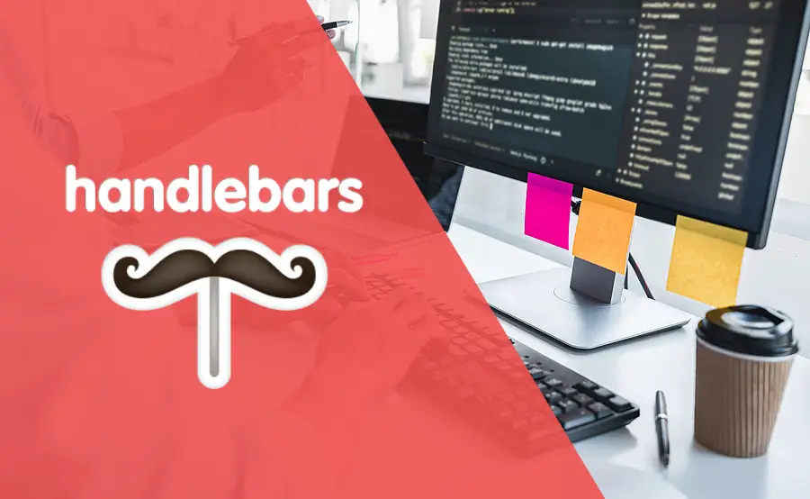

# Day 10: Express and Handlebars.js 🚀

## Overview 🌟
Today, we will learn about **Handlebars.js**, a powerful and minimalistic templating engine, and how it integrates seamlessly with **Express.js** for dynamic web development.

<div align="center">
    
</div>

---

## **What is Handlebars.js?** 🤔
Handlebars.js is a simple templating language that enables you to:
1. Build reusable HTML templates.
2. Create dynamic content by injecting data into templates.
3. Use simple logic within templates like conditions and loops.

---

## **Installing Handlebars in Express.js** 🛠️
To integrate Handlebars with an Express project, follow these steps:

### **Step 1: Install Handlebars and Setup Tools**
Install the necessary packages:
```bash
npm install express-handlebars
```

### **Step 2: Configure Handlebars in Express**
In your `app.js` file, set up Handlebars as the view engine:

```javascript
const express = require('express');
const exphbs = require('express-handlebars');

const app = express();

// Set Handlebars as the template engine
app.engine('handlebars', exphbs());
app.set('view engine', 'handlebars');

// Start the server
const PORT = 3000;
app.listen(PORT, () => {
    console.log(`Server is running on http://localhost:${PORT}`);
});
```

---

## **Creating Handlebars Views** 📂
To use Handlebars templates, create a `views` folder in your project root directory.

### **Example File Structure:**
```plaintext
myApp/
├── app.js          # Main application file
├── package.json    # Metadata and dependencies
├── views/          # Folder for Handlebars templates
│   ├── layouts/    # Folder for layout templates
│   │   └── main.handlebars
│   └── home.handlebars
```

### **Step 1: Define a Layout**
Create a `main.handlebars` file in the `layouts/` folder. This file acts as a wrapper for all your views.
```html
<!DOCTYPE html>
<html lang="en">
<head>
    <meta charset="UTF-8">
    <meta name="viewport" content="width=device-width, initial-scale=1.0">
    <title>{{title}}</title>
</head>
<body>
    <header>
        <h1>Welcome to Handlebars with Express!</h1>
    </header>
    <main>
        {{{body}}}
    </main>
    <footer>
        <p>&copy; 2024 Express Learning Path</p>
    </footer>
</body>
</html>
```

### **Step 2: Create a View**
Create a `home.handlebars` file in the `views/` folder. This file will contain the content for your homepage:
```html
<h2>{{welcomeMessage}}</h2>
<p>This is a dynamic page rendered using Handlebars!</p>
```

---

## **Rendering Handlebars Views** ✨
To render a Handlebars view, use the `res.render` method in your route handler:

```javascript
app.get('/', (req, res) => {
    res.render('home', {
        layout: 'main', // Optional: Defaults to `main` layout
        title: 'Homepage',
        welcomeMessage: 'Hello, Handlebars!',
    });
});
```
---

## **Key Features of Handlebars.js** ✨
1. **Template Expressions**: Inject dynamic content using `{{}}`.
   ```html
   <p>Hello, {{name}}!</p>
   ```

2. **Conditional Rendering**: Use `{{#if}}` for conditional content.
   ```html
   {{#if isLoggedIn}}
       <p>Welcome back!</p>
   {{else}}
       <p>Please log in.</p>
   {{/if}}
   ```

3. **Iteration**: Use `{{#each}}` to loop through arrays.
   ```html
   <ul>
       {{#each items}}
           <li>{{this}}</li>
       {{/each}}
   </ul>
   ```

4. **Partials**: Reuse components within templates.
   ```javascript
   app.engine('handlebars', exphbs({
       partialsDir: ["views/partials/"]
   }));
   ```

---

## **Exercise for Day 10** 📝
1. Install Handlebars in an existing Express app.
2. Create a `main.handlebars` layout and a `home.handlebars` view.
3. Add dynamic data like `title` and `welcomeMessage`.
4. Experiment with Handlebars helpers, conditional rendering, and loops.

---

## **Key Takeaways** 🧾
1. Handlebars is a simple and flexible templating engine for building dynamic pages.
2. Layouts and Partials enhance code reusability and consistency.
3. Dynamic data and logic-driven templates make Handlebars powerful for server-side rendering.

---

### Next Steps 🚀
In **Day 11**, we will explore middleware in Express.js to handle various request-response cycles efficiently. Stay tuned! 🌟

