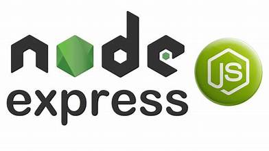
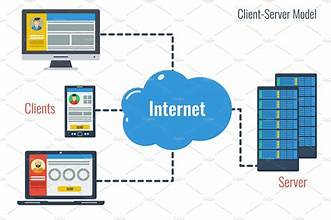
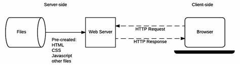
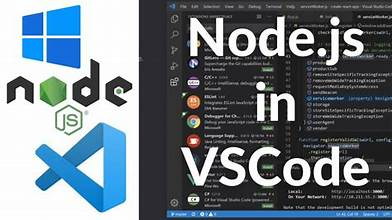

# Day 1: Introduction to Web Development 🌟

## Overview 📖
Web development is the process of building and maintaining websites or web applications that run on the internet. It involves using various technologies, frameworks, and tools to create robust, user-friendly solutions.

    

---

### **Key Concepts** 🧩

#### 1. **Server** 🖥️
- A server is a system that provides resources, services, or data to other computers (clients) over a network.
- In web development, servers are responsible for hosting websites and handling requests from users.

#### 2. **Client** 💻
- A client is a device or program that requests resources or services from a server.
- Examples: Web browsers (Chrome, Firefox) are clients that request web pages from servers.

#### 3. **Web Application** 🌐
- A web application is a dynamic, interactive program accessed through a web browser.
- Examples: E-commerce websites, social media platforms, and email services.

    

    

---

### **Roadmap Brief** 🗺️
During this 30-day challenge, you will:
1. **Javascript basics**
   - Node.js
3. **Learn Backend Development** 🚀
   - Node.js, Express.js.
4. **Work with Databases** 🗄️
   - MongoDB: Storing and managing data.
5. **Build a Full-Stack E-Commerce Project** 🛒
   - Authentication.
   - Product listings, cart, and order management.
   - Payment gateway.
   - Deploy your application.

---

### **Skills and Knowledge Gained** 🎓
After completing this challenge, you will:

1. **Master Backend Development:** 🔧
   - Build server-side applications using Node.js and Express.js.
2. **Database Handling:** 🗂️
   - Perform CRUD operations in MongoDB.
   - Integrate databases with applications.
3. **Front-end Development:** 🎨
   - Design and create user interfaces.
4. **Full-Stack Proficiency:** 🛠️
   - Build complete web applications from scratch.
5. **Project Deployment:** 🚀
   - Host applications on platforms like Heroku, Vercel.
6. **Problem-Solving:** 🧠
   - Debugging, error handling, and optimizing web applications.
7. **Collaboration:** 🤝
   - Understand version control using Git/GitHub.

---

### **Plan for Day 1** 📅
1. Learn the basic structure of a client-server architecture. 🌍
2. Understand what a web application is and its components. 🔗
3. Get a high-level understanding of this challenge and what you will achieve. 🚩
4. Install development tools:
   - VS Code. 🖋️
   - Node.js and NPM. 📦

---

### **Installation Guide** 🛠️

#### **Install VS Code** 🖋️
1. Go to the [VS Code website](https://code.visualstudio.com/). 🌐
2. Download the installer for your operating system (Windows, macOS, or Linux). 🖥️
3. Run the installer and follow the setup instructions. ▶️
4. Launch VS Code and customize the settings and extensions as needed (e.g., Prettier, ESLint). ✨

    

#### **Install Node.js and NPM** 📦
1. Visit the [Node.js website](https://nodejs.org/). 🌍
2. Download the LTS (Long-Term Support) version suitable for your OS. 💾
3. Run the installer and follow the on-screen instructions. ✔️
   - Ensure the option to install `npm` (Node Package Manager) is selected. 🔗
4. Verify installation:
   - Open a terminal and type `node -v` to check the Node.js version. 💻
   - Type `npm -v` to check the NPM version. 📄

**Next Step:** Tomorrow, we dive into setting up Node.js 🚀
