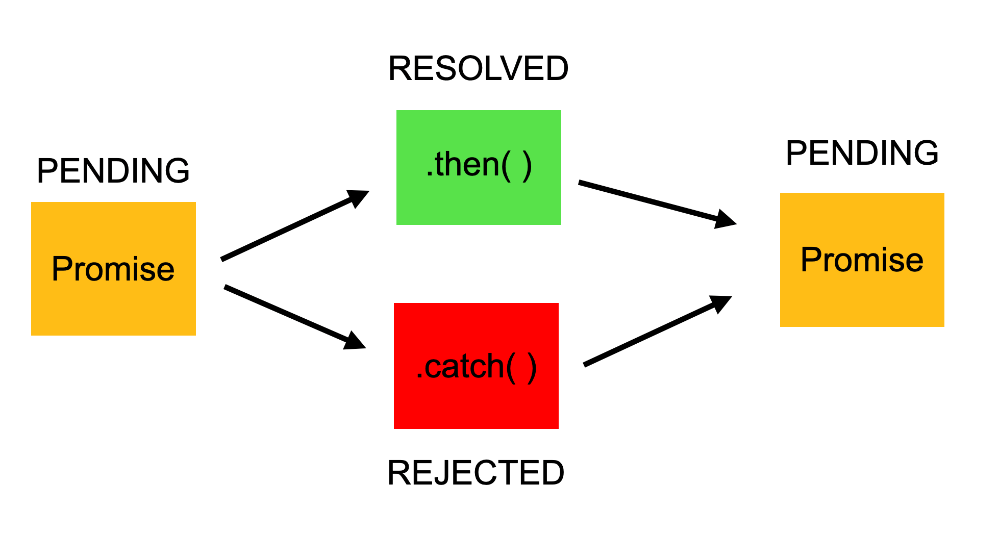

# Day 13: Introduction to Promises in JavaScript 🚀

## Overview 🌟
Promises in JavaScript are used for handling asynchronous operations. They provide a cleaner and more manageable way to work with asynchronous code compared to callbacks.

<div align="center">
    
</div>

---

## **1. What is a Promise?** 🤔
A **Promise** is an object that represents the eventual completion (or failure) of an asynchronous operation and its resulting value. It has three states:
- **Pending**: The operation is still in progress.
- **Fulfilled**: The operation was successful.
- **Rejected**: The operation failed.

### **Creating a Promise** 📜
```javascript
const myPromise = new Promise((resolve, reject) => {
    let success = true; // Simulating success condition
    setTimeout(() => {
        if (success) {
            resolve("Promise Resolved Successfully!");
        } else {
            reject("Promise Rejected!");
        }
    }, 2000);
});

myPromise
    .then(result => console.log(result)) // Executes if resolved
    .catch(error => console.log(error)); // Executes if rejected
```

---

## **2. Callback vs. Promise** 🔄➡️➡️
| Feature | Callback | Promise |
|---------|---------|---------|
| Readability | Difficult to manage as nested callbacks lead to "callback hell" | More readable and structured |
| Error Handling | Hard to track errors | Centralized `.catch()` for errors |
| Flexibility | Less flexible | Can be chained using `.then()` |

### **Example of Callback Hell** 😵‍💫
```javascript
function step1(callback) {
    setTimeout(() => {
        console.log("Step 1 completed");
        callback();
    }, 1000);
}

function step2(callback) {
    setTimeout(() => {
        console.log("Step 2 completed");
        callback();
    }, 1000);
}

step1(() => {
    step2(() => {
        console.log("All steps completed!");
    });
});
```

### **Refactored with Promises** 💡
```javascript
function step1() {
    return new Promise(resolve => {
        setTimeout(() => {
            console.log("Step 1 completed");
            resolve();
        }, 1000);
    });
}

function step2() {
    return new Promise(resolve => {
        setTimeout(() => {
            console.log("Step 2 completed");
            resolve();
        }, 1000);
    });
}

step1()
    .then(() => step2())
    .then(() => console.log("All steps completed!"));
```

---

## **3. Handling Errors with Promises** ⚠️
Promises provide a clean error-handling mechanism using `.catch()`
```javascript
const errorPromise = new Promise((resolve, reject) => {
    let success = false;
    setTimeout(() => {
        if (success) {
            resolve("Operation successful!");
        } else {
            reject("Operation failed!");
        }
    }, 2000);
});

errorPromise
    .then(result => console.log(result))
    .catch(error => console.log("Error:", error));
```

---

## **4. Summary & Next Steps** 📝
✅ Promises improve **readability and maintainability** over callbacks.
✅ They help handle **asynchronous operations** more efficiently.
✅ `.then()` is used to handle fulfilled Promises, while `.catch()` manages errors.

### **Next Day: Async/Await!** 🚀
In **Day 14**, we will explore **Async/Await**, which makes handling Promises even easier!

---

