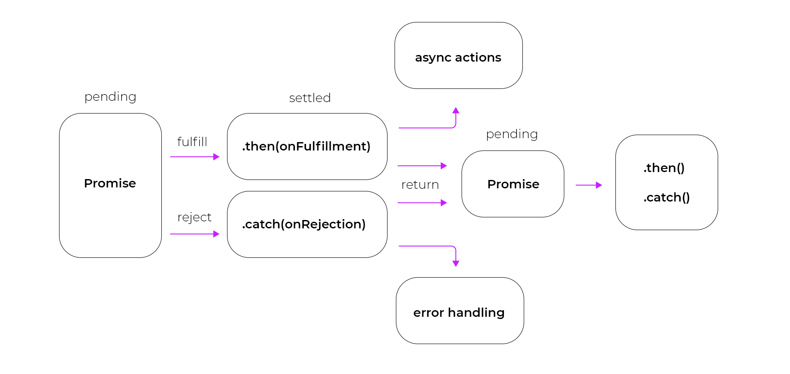

# Day 14: Promises, Async, and Await in Node.js 🚀

## Overview 🌟
In Node.js, **Promises**, **Async**, and **Await** are essential for handling asynchronous operations efficiently. They simplify working with asynchronous code and improve readability.

<div align="center">
    
</div>

---

## **1. Revisiting Promises** 📜
A **Promise** represents a value that may be available now, or in the future, or never.

### **Creating a Promise in Node.js**
```javascript
const fetchData = () => {
    return new Promise((resolve, reject) => {
        setTimeout(() => {
            let success = true;
            if (success) {
                resolve("Data fetched successfully!");
            } else {
                reject("Failed to fetch data");
            }
        }, 2000);
    });
};

fetchData()
    .then(data => console.log(data))
    .catch(error => console.log(error));
```

---

## **2. Async/Await: The Modern Approach** 🚀
Async/Await is a syntactic sugar over Promises, making asynchronous code look more like synchronous code.

### **Declaring an Async Function**
```javascript
async function fetchData() {
    return "Data fetched successfully!";
}

fetchData().then(data => console.log(data));
```

### **Using Await with Promises**
```javascript
async function fetchDataWithAwait() {
    try {
        let data = await fetchData();
        console.log(data);
    } catch (error) {
        console.log("Error:", error);
    }
}

fetchDataWithAwait();
```

---

## **3. Handling Errors in Async/Await** ⚠️
Errors in async functions should be handled using `try...catch`.
```javascript
async function getData() {
    try {
        let result = await fetchData();
        console.log(result);
    } catch (error) {
        console.log("Error caught:", error);
    }
}

getData();
```

---

## **4. Combining Multiple Async Functions** 🔄
```javascript
async function firstTask() {
    return new Promise(resolve => setTimeout(() => resolve("First Task Done"), 1000));
}

async function secondTask() {
    return new Promise(resolve => setTimeout(() => resolve("Second Task Done"), 1500));
}

async function runTasks() {
    console.log(await firstTask());
    console.log(await secondTask());
    console.log("All tasks completed!");
}

runTasks();
```

---

## **5. Summary & Next Steps** 📝
✅ Promises handle asynchronous operations in a structured way.
✅ Async/Await makes code easier to read and maintain.
✅ `try...catch` should be used for handling errors in async functions.

### **Next Day: Express Middleware & API Handling!** 🚀
In **Day 15**, we will explore **Express Middleware** and how to handle API requests efficiently!

---

