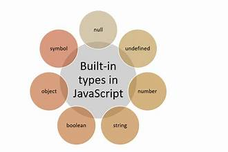
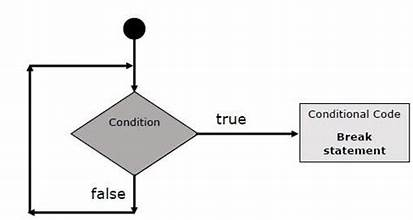

# Day 2: Node.js Variables and Control Statements

## Overview 🖋️
Today, we will focus on learning the fundamentals of **variables** and **control statements** in Node.js. These are essential building blocks for writing logical and dynamic applications.

<div align="center">
    
</div>

---

## **Variables in Node.js** 📝
Variables are used to store data values that can be reused and manipulated in a program. Node.js supports three ways to declare variables:

### **1. Using `var` (Function Scoped)**
- Example:
```javascript
var name = "John";
console.log(name); // Output: John
```

### **2. Using `let` (Block Scoped)**
- Example:
```javascript
let age = 25;
age = 26; // Allowed
console.log(age); // Output: 26
```

### **3. Using `const` (Block Scoped, Constant Value)**
- Example:
```javascript
const PI = 3.14;
// PI = 3.15; // Error: Assignment to constant variable
console.log(PI); // Output: 3.14
```

### **Variable Types in Node.js**
1. **Number**:
   - Example: `let num = 10;`
2. **String**:
   - Example: `let str = "Hello";`
3. **Boolean**:
   - Example: `let isActive = true;`
4. **Array**:
   - Example: `let fruits = ["Apple", "Banana", "Cherry"];`
5. **Object**:
   - Example:
     ```javascript
     let user = {
       name: "John",
       age: 30
     };
     ```
6. **Null**:
   - Example: `let emptyValue = null;`
7. **Undefined**:
   - Example: `let uninitialized; // undefined`

---

## **Control Statements in Node.js** 🚦
Control statements are used to make decisions and execute code blocks based on specific conditions or loops.

<div align="center">
    
</div>


### **1. If-Else Statement** 🌟
- Example:
```javascript
let num = 10;
if (num > 5) {
  console.log("Number is greater than 5");
} else {
  console.log("Number is 5 or less");
}
```

### **2. Switch Statement** 🔀
- Example:
```javascript
let day = 2;
switch (day) {
  case 1:
    console.log("Monday");
    break;
  case 2:
    console.log("Tuesday");
    break;
  default:
    console.log("Other day");
}
```

### **3. For Loop** 🔁
- Example:
```javascript
for (let i = 0; i < 5; i++) {
  console.log(i);
}
```

### **4. While Loop** 🔄
- Example:
```javascript
let i = 0;
while (i < 5) {
  console.log(i);
  i++;
}
```

### **5. Do-While Loop** 🌀
- Example:
```javascript
let i = 0;
do {
  console.log(i);
  i++;
} while (i < 5);
```

### **6. Break and Continue** 🛑
- **Break**:
  ```javascript
  for (let i = 0; i < 5; i++) {
    if (i === 3) break;
    console.log(i);
  }
  // Output: 0, 1, 2
  ```
- **Continue**:
  ```javascript
  for (let i = 0; i < 5; i++) {
    if (i === 3) continue;
    console.log(i);
  }
  // Output: 0, 1, 2, 4
  ```

---

## Summary 🧾
By the end of Day 2, you should be comfortable with:
1. Declaring and initializing variables using `var`, `let`, and `const`.
2. Understanding different types of variables in Node.js.
3. Writing conditional logic using `if-else` and `switch` statements.
4. Implementing loops (`for`, `while`, and `do-while`).
5. Using `break` and `continue` to control loop execution.

Next, we will explore **functions and Objects** in Node.js on Day 3. Stay tuned! 🚀

