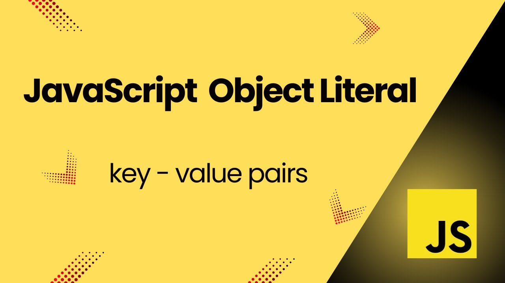
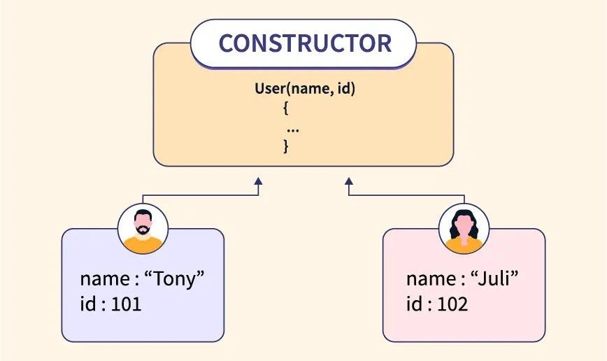

# Day 3: Object Literals, Object Constructors, and Dates

## Overview 📖
Today, we will explore how to work with **objects** in Node.js using object literals and constructors. We will also dive into handling dates, a crucial aspect for building dynamic web applications.

---

## **Object Literals** 📦
An object literal is a simple and concise way to create objects in JavaScript.

<div align="center">
    
</div>

### **Syntax**
```javascript
const objectName = {
  key1: value1,
  key2: value2,
  // Additional key-value pairs
};
```

### **Example**
```javascript
const person = {
  firstName: "John",
  lastName: "Doe",
  age: 30,
  greet: function() {
    return `Hello, my name is ${this.firstName} ${this.lastName}`;
  }
};

console.log(person.greet()); // Output: Hello, my name is John Doe
```

---

## **Object Constructors** 🏗️
Object constructors provide a way to create objects using templates, making them reusable for multiple instances.

<div align="center">
    
</div>

### **Syntax**
```javascript
function ConstructorName(param1, param2) {
  this.key1 = param1;
  this.key2 = param2;
}
```

### **Example**
```javascript
function Car(make, model, year) {
  this.make = make;
  this.model = model;
  this.year = year;
}

const car1 = new Car("Toyota", "Corolla", 2020);
const car2 = new Car("Honda", "Civic", 2021);

console.log(car1); // Output: { make: 'Toyota', model: 'Corolla', year: 2020 }
console.log(car2); // Output: { make: 'Honda', model: 'Civic', year: 2021 }
```

---

## **Working with Dates** 📆
Node.js provides the built-in `Date` object to handle date and time operations.

### **Creating a Date Object**
You can create a date object in several ways:
1. **Current Date and Time:**
   ```javascript
   const now = new Date();
   console.log(now); // Outputs the current date and time
   ```
2. **Specific Date:**
   ```javascript
   const specificDate = new Date("2025-01-21");
   console.log(specificDate); // Outputs: 2025-01-21T00:00:00.000Z
   ```
3. **Using Year, Month, Day:**
   ```javascript
   const customDate = new Date(2025, 0, 21); // Month is 0-indexed
   console.log(customDate); // Outputs: 2025-01-21T00:00:00.000Z
   ```

### **Common Date Methods**
- **Get Current Date and Time:**
  ```javascript
  const now = new Date();
  console.log(now.toString()); // Outputs a readable date string
  ```
- **Extracting Date Components:**
  ```javascript
  const now = new Date();
  console.log(now.getFullYear()); // Outputs the year
  console.log(now.getMonth() + 1); // Outputs the month (1-12)
  console.log(now.getDate()); // Outputs the day of the month
  ```
- **Manipulating Dates:**
  ```javascript
  const tomorrow = new Date();
  tomorrow.setDate(tomorrow.getDate() + 1);
  console.log(tomorrow); // Outputs tomorrow's date
  ```

---

## Summary 🧾
By the end of Day 3, you will:

1. Understand how to use object literals to create objects easily. 🛠️
2. Learn how to create reusable templates with object constructors. 🔧
3. Be comfortable working with the `Date` object to handle date and time operations. 📅

Next, we will cover **Functions in Node.js** on Day 4. Stay tuned! 🚀

