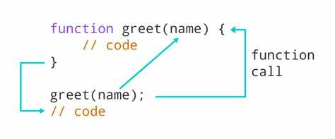
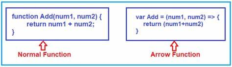

# Day 4: Functions, Arrow Functions, and Callbacks

## Overview 🔍
Functions are one of the most important building blocks in any programming language. Today, we'll explore:
1. Regular functions.
2. Arrow functions.
3. Using callbacks to handle asynchronous behavior.

---

## **Functions in JavaScript** 🛠️
A function is a reusable block of code designed to perform a specific task.

<div align="center">
    
</div>

### **1. Function Declaration**
- Example:
```javascript
function greet(name) {
  return `Hello, ${name}!`;
}

console.log(greet("John")); // Output: Hello, John!
```

### **2. Function Expressions**
A function can also be assigned to a variable.
- Example:
```javascript
const greet = function(name) {
  return `Hello, ${name}!`;
};

console.log(greet("John")); // Output: Hello, John!
```

---

## **Arrow Functions** ➡️
Arrow functions provide a more concise syntax for writing functions and do not bind their own `this`.

<div align="center">
    
</div>

### **Syntax**
```javascript
const functionName = (parameters) => expression;
```

### **Examples**
1. **Single Parameter**:
   ```javascript
   const square = x => x * x;
   console.log(square(5)); // Output: 25
   ```

2. **Multiple Parameters**:
   ```javascript
   const add = (a, b) => a + b;
   console.log(add(3, 7)); // Output: 10
   ```

3. **With Block Body**:
   ```javascript
   const multiply = (a, b) => {
     const result = a * b;
     return result;
   };
   console.log(multiply(4, 5)); // Output: 20
   ```

---

## **Callback Functions** 🕒
A callback is a function passed as an argument to another function. It is often used for asynchronous operations like fetching data, reading files, or handling events.

<div align="center">
    
</div>

### **Why Use Callbacks?**
Callbacks allow code to execute after an asynchronous task is completed.

### **Example**
```javascript
function fetchData(callback) {
  setTimeout(() => {
    console.log("Data fetched!");
    callback();
  }, 2000);
}

function processData() {
  console.log("Processing data...");
}

fetchData(processData);
// Output:
// Data fetched! (after 2 seconds)
// Processing data...
```

### **Anonymous Callback**
You can pass anonymous functions directly as callbacks:
```javascript
fetchData(() => {
  console.log("Processing data directly in callback!");
});
```

---

## Summary 🧾
By the end of Day 4, you will:

1. Understand how to define and use functions in Node.js. 🖋️
2. Leverage concise syntax with arrow functions. 🚀
3. Utilize callbacks for handling asynchronous operations. 🔄

Tomorrow, we will dive into **Promises and Async/Await**, which offer advanced ways to handle asynchronous tasks in Node.js. Stay tuned! ✨

