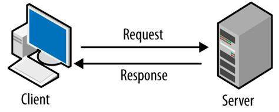

# Day 6: Simple Server Creation and Serving HTML Files

## Overview 🌐
On Day 6, we will:
1. Learn how to create a basic server using Node.js.
2. Serve an HTML file as a response to client requests.

This will lay the foundation for building dynamic web applications! 🚀

---

## **Creating a Simple Server** 🖥️

### **Steps to Create a Server:**
1. Import the required `http` module.
2. Use the `http.createServer()` method.
3. Define the request and response logic.
4. Listen for incoming requests on a specific port.

<div align="center">
    
</div>

### **Example Code**
```javascript
const http = require('http');

const server = http.createServer((req, res) => {
  res.statusCode = 200; // HTTP Status: OK
  res.setHeader('Content-Type', 'text/plain'); // Setting response header
  res.end('Hello, World!'); // Response body
});

const PORT = 3000;
server.listen(PORT, () => {
  console.log(`Server is running at http://localhost:${PORT}`);
});
```

Run the above code using:
```bash
node server.js
```
Open your browser and navigate to `http://localhost:3000` to see the output.

---

## **Serving an HTML File** 📄

To serve an HTML file, you will:
1. Use the `fs` module to read the HTML file.
2. Send the file's contents as the response.

<div align="center">
    
</div>

### **Example Code**
File: `index.html`
```html
<!DOCTYPE html>
<html lang="en">
<head>
  <meta charset="UTF-8">
  <meta name="viewport" content="width=device-width, initial-scale=1.0">
  <title>Node.js HTML Response</title>
</head>
<body>
  <h1>Welcome to My Node.js Server</h1>
  <p>This is an HTML response from a Node.js server.</p>
</body>
</html>
```

File: `server.js`
```javascript
const http = require('http');
const fs = require('fs');

const server = http.createServer((req, res) => {
  if (req.url === '/') {
    fs.readFile('index.html', (err, data) => {
      if (err) {
        res.writeHead(500, { 'Content-Type': 'text/plain' });
        res.end('Internal Server Error');
      } else {
        res.writeHead(200, { 'Content-Type': 'text/html' });
        res.end(data);
      }
    });
  } else {
    res.writeHead(404, { 'Content-Type': 'text/plain' });
    res.end('404 Not Found');
  }
});

const PORT = 3000;
server.listen(PORT, () => {
  console.log(`Server is running at http://localhost:${PORT}`);
});
```

### **Steps to Run the Code:**
1. Save the `index.html` and `server.js` files in the same directory.
2. Start the server using:
   ```bash
   node server.js
   ```
3. Open your browser and navigate to `http://localhost:3000` to view the HTML response.

---

## **Key Takeaways** 📘
By the end of Day 6, you will:
1. Understand how to create a simple HTTP server with Node.js.
2. Serve static HTML files using the `fs` module.
3. Handle basic HTTP routes and errors.

Tomorrow, we will explore **Serving CSS and JS files** for a fully styled website! 🎨 Stay tuned! 💻

