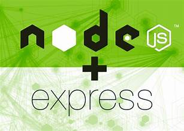

# Day 9: Express and Express Generator 🚀

## Overview 🌟
Today, we will delve deeper into **Express.js** and explore a powerful tool known as the **Express Generator**, which simplifies the process of scaffolding Express applications.

<div align="center">
    
</div>

---

## **What is Express Generator?** 🤔
The Express Generator is a command-line tool that generates a boilerplate structure for Express.js projects, allowing developers to kickstart their applications quickly.

It provides a pre-organized folder structure and basic setup for:
- Middleware configuration
- Routing
- Error handling

---

## **Installing Express Generator** 🛠️
### **Step 1: Install Globally**
To install the Express Generator globally, run the following command:
```bash
npm install -g express-generator
```

### **Step 2: Verify Installation**
Check if the generator is installed by typing:
```bash
express --version
```
You should see the version number if it’s installed correctly.

---

## **Creating an Express Application** ✨
Using the Express Generator, you can create a new Express.js project in seconds.

### **Command to Create a Project:**
```bash
express <project-name> [options]
```

### **Example:**
To create a new project named `myApp`:
```bash
express myApp
```

### **Optional Flags:**
- `--view <engine>`: Specify a template engine (e.g., `ejs`, `pug`, `hbs`).
- `--git`: Add a `.gitignore` file.
- `--css <style>`: Specify a CSS preprocessor (e.g., `less`, `scss`, `stylus`).
- `--force`: Overwrite existing files in the target directory.

#### Example with EJS and SCSS:
```bash
express myApp --view=ejs --css=scss
```

---

## **Running Your Application** 🏃‍♂️

### **Step 1: Navigate to the Project Directory**
```bash
cd myApp
```

### **Step 2: Install Dependencies**
Use npm or yarn to install the dependencies:
```bash
npm install
```

### **Step 3: Start the Application**
Run the following command to start the server:
```bash
npm start
```

### **Step 4: View in Browser**
Open your browser and go to:
```
http://localhost:3000
```
You should see the default homepage of the generated Express app.

---

## **Understanding the Generated Folder Structure** 📂
Here is a quick overview of the Express app folder structure:

```plaintext
myApp/
├── app.js          # Entry point for the app
├── package.json    # Project metadata and dependencies
├── public/         # Static files (CSS, JS, images)
├── routes/         # Route definitions
│   ├── index.js
│   └── users.js
├── views/          # Template files (EJS, Pug, etc.)
└── bin/            # Server startup script
```

---

## **Key Advantages of Express Generator** ✨
1. Saves time by creating a ready-to-use project structure.
2. Provides a standardized layout for teams to collaborate effectively.
3. Simplifies the process of setting up template engines and CSS preprocessors.

---

## **Manually Adding Features to the Generated App** 🛠️
After scaffolding an app with the Express Generator, you can customize it further by:
- Adding **new routes** in the `routes/` folder.
- Using **middleware** like `body-parser` and `cookie-parser`.
- Integrating with a **database** like MongoDB or MySQL.
- Installing additional npm packages as needed.

---

## **Exercise for Day 9** 📝
1. Install the Express Generator globally on your machine.
2. Create a new project using the generator with EJS as the template engine.
3. Start the server and explore the generated structure.
4. Modify the `index.js` file to add a custom route (e.g., `/hello`).

---

## **Key Takeaways** 🧾
1. The **Express Generator** streamlines the setup process for new applications.
2. Familiarize yourself with the folder structure to make modifications effectively.
3. You can extend the functionality of the generated app by adding middleware, routes, and database integration.

---

### Next Steps 🚀
In **Day 10**, we will dive into **middleware in Express.js** and learn how to handle POST requests. Stay tuned! 🎉

